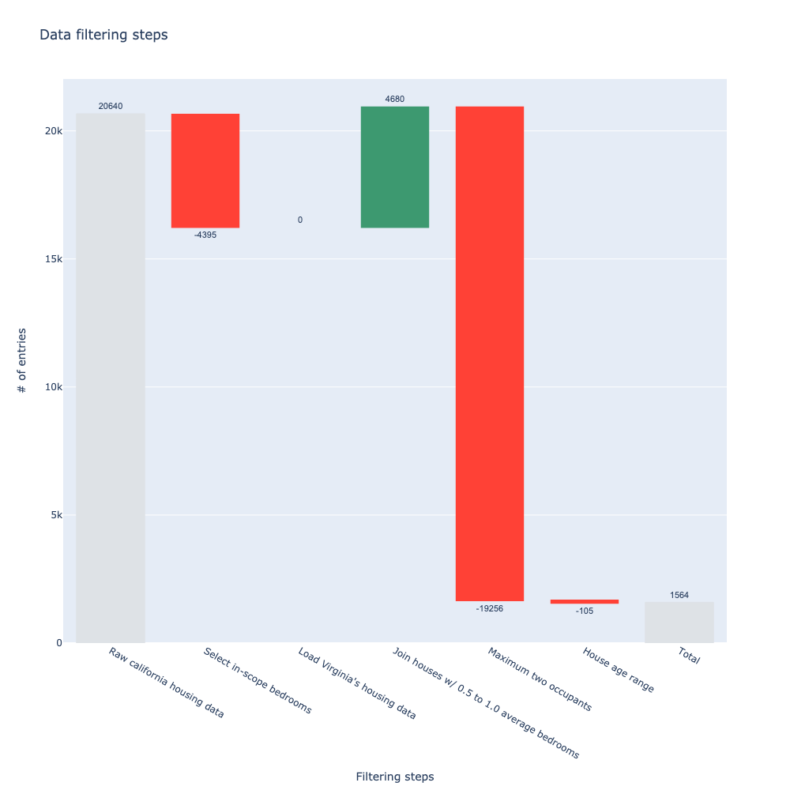

# Logging California housing data

!!! note
    A tutorial serves the needs of the user who is at study and they are learning-oriented.

## Helper functions

Below you can find several helper functions to scope data.

```python
from typing import Dict, Any

import pandas as pd

def filter_bedrooms(df: pd.DataFrame, settings: Dict[str, Any]):
    """Filters houses with at least one bedroom in the block."""
    return df.loc[lambda row: row['AveBedrms'] >= settings['min_bedrooms']]


def filter_household_members(df: pd.DataFrame, settings: Dict[str, Any]):
    """Filters houses for one or two household members."""
    return df.loc[lambda row: row['AveOccup'] <= settings['max_occupants']]


def filter_house_age_range(df: pd.DataFrame, settings: Dict[str, Any]):
    """Filters houses aged between two ages."""
    return df.loc[
        lambda row: (row['HouseAge'] >= settings['house_age'][0]) & (row['HouseAge'] <= settings['house_age'][1])
    ]


def join_new_house_data(df1: pd.DataFrame, df2: pd.DataFrame):
    """Appends houses with an average number of bedrooms in the block between 0.5 and 1.0."""
    return pd.concat(
        [df1, df2.loc[lambda row: (row['AveBedrms'] >= 0.5) & (row['AveBedrms'] <= 1.0)]],
        join='outer',
        ignore_index=True,
    )
```

## Logging

Below you can find the `PandasWaterfall` implementation for scoping a dataset imported from scikit-learn.

```python
from sklearn import datasets

from waterfall_logging.log import PandasWaterfall


california_housing = datasets.fetch_california_housing(as_frame=True)
california_housing_df = california_housing.frame

settings = {
    'min_bedrooms': 1.0,
    'max_occupants': 2.0,
    'house_age': [10, 80],
    'join_new_houses': True,
}

waterfall_log = PandasWaterfall(table_name='california housing', columns=['MedInc', 'AveRooms'],  distinct_columns=['Population'])
waterfall_log.log(california_housing_df, reason='Raw california housing data', configuration_flag=None)

california_housing_df = filter_bedrooms(california_housing_df, settings)
waterfall_log.log(california_housing_df, reason='Select in-scope bedrooms', configuration_flag=f"{settings['min_bedrooms']}")

if settings['join_new_houses']:
    waterfall_log.log(california_housing.frame, table_name='virginia housing', reason="Load Virginia's housing data", configuration_flag='n/a')

    california_housing_df = join_new_house_data(california_housing_df, california_housing.frame)
    waterfall_log.log(california_housing_df, reason='Join houses w/ 0.5 to 1.0 average bedrooms', configuration_flag=f"{settings['join_new_houses']}")

california_housing_df = filter_household_members(california_housing_df, settings)
waterfall_log.log(california_housing_df, reason='Maximum two occupants', configuration_flag=f"{settings['max_occupants']}")

california_housing_df = filter_house_age_range(california_housing_df, settings)
waterfall_log.log(california_housing_df, reason='House age range', configuration_flag=f"{settings['house_age']}")

waterfall_log.to_markdown('/output/tests/california_housing.md')

waterfall_log = PandasWaterfall(table_name='california housing')
waterfall_log.read_markdown('/output/tests/california_housing.md',
    sep='|', header=0, index_col=False, skiprows=[1], skipinitialspace=True
)
```

## Plotting

Below you can see how to plot the markdown table.

```python
fig = waterfall_log.plot(y_col='MedInc', y_col_delta='Δ MedInc', x_col='Reason', drop_zero_delta=False,
    textfont=dict(family='sans-serif', size=11),
    connector={'line': {'color': 'rgba(0,0,0,0)'}},
    totals={'marker': {'color': '#dee2e6', 'line': {'color': '#dee2e6', 'width': 1}}}
)

fig.update_layout(
    autosize=True,
    width=1000,
    height=1000,
    title=f'Data filtering steps',
    xaxis=dict(title='Filtering steps'),
    yaxis=dict(title='# of entries'),
    showlegend=False,
    waterfallgroupgap=0.1,
)

fig.update_traces(
    textposition='outside',
)

fig.write_image('/output/tests/california_housing.png')
```


