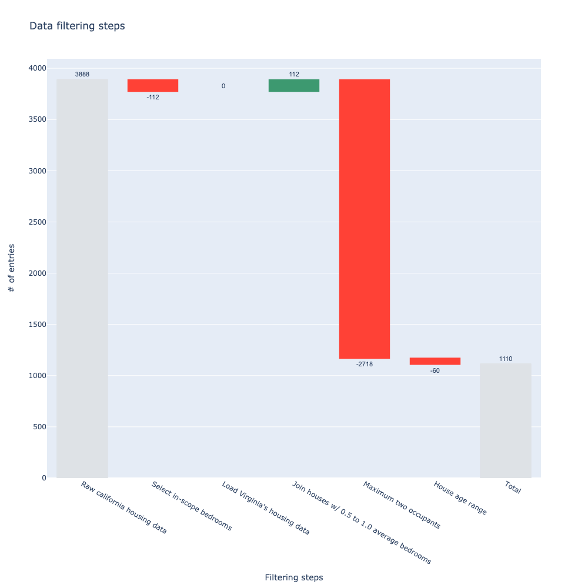

# SparkWaterfall

This part of the project documentation focuses on a *learning-oriented* approach.
Use the tutorial below to learn how this package can be useful.

## California housing data

In this tutorial you'll learn how the `SparkWaterfall` can log and plot several filtering steps on the California housing dataset.

### Helper functions

Below you can find several helper functions to scope or filter the dataset.

```python
from typing import Dict, Any

import pyspark
import pyspark.sql.functions as F

def filter_bedrooms(sdf: pyspark.sql.DataFrame, settings: Dict[str, Any]):
    """Filters houses with at least one bedroom in the block."""
    return sdf.filter(F.col('AveBedrms') >= settings['min_bedrooms'])

def filter_household_members(sdf: pyspark.sql.DataFrame, settings: Dict[str, Any]):
    """Filters houses for one or two household members."""
    return sdf.filter(F.col('AveOccup') <= settings['max_occupants'])

def filter_house_age_range(sdf: pyspark.sql.DataFrame, settings: Dict[str, Any]):
    """Filters houses aged between two ages."""
    return sdf.filter((F.col('HouseAge') >= settings['house_age'][0]) & (F.col('HouseAge') <= settings['house_age'][1]))

def join_new_house_data(sdf1: pyspark.sql.DataFrame, sdf2: pyspark.sql.DataFrame):
    """Appends houses with an average number of bedrooms in the block between 0.5 and 1.0."""
    return sdf1.union(sdf2.filter((F.col('AveBedrms') >= 0.5) & (F.col('AveBedrms') <= 1.0)))
```

## Logging

Below you can find the `SparkWaterfall` implementation for scoping a dataset imported from scikit-learn.

```python
from sklearn import datasets
import pyspark
from waterfall_logging.log import SparkWaterfall

california_housing = datasets.fetch_california_housing(as_frame=True)
california_housing_df = california_housing.frame.reset_index()

spark_session = pyspark.sql.SparkSession.builder.enableHiveSupport().appName(str(__file__)).getOrCreate()
california_housing_sdf = spark_session.createDataFrame(california_housing_df)

settings = {
    'min_bedrooms': 1.0,
    'max_occupants': 2.0,
    'house_age': [10, 80],
    'join_new_houses': True,
}

waterfall_log = SparkWaterfall(table_name='california housing', columns=['MedInc', 'AveRooms'],  distinct_columns=['Population'])
waterfall_log.log(california_housing_sdf, reason='Raw california housing data', configuration_flag=None)

california_housing_sdf = filter_bedrooms(california_housing_sdf, settings)
waterfall_log.log(california_housing_sdf, reason='Select in-scope bedrooms', configuration_flag=f"{settings['min_bedrooms']}")

if settings['join_new_houses']:
    virgina_housing_sdf = spark_session.createDataFrame(california_housing_df)
    waterfall_log.log(virgina_housing_sdf, table_name='virginia housing', reason="Load Virginia's housing data", configuration_flag='n/a')

    california_housing_sdf = join_new_house_data(california_housing_sdf, virgina_housing_sdf)
    waterfall_log.log(california_housing_sdf, reason='Join houses w/ 0.5 to 1.0 average bedrooms', configuration_flag=f"{settings['join_new_houses']}")

california_housing_sdf = filter_household_members(california_housing_sdf, settings)
waterfall_log.log(california_housing_sdf, reason='Maximum two occupants', configuration_flag=f"{settings['max_occupants']}")

california_housing_sdf = filter_house_age_range(california_housing_sdf, settings)
waterfall_log.log(california_housing_sdf, reason='House age range', configuration_flag=f"{settings['house_age']}")

waterfall_log.to_markdown('output/tests/california_housing_sdf.md')

waterfall_log = SparkWaterfall(table_name='california housing sdf')
waterfall_log.read_markdown('output/tests/california_housing_sdf.md',
    sep='|', header=0, index_col=False, skiprows=[1], skipinitialspace=True
)
```

## Plotting

Below you can see how to plot the markdown table.

```python
fig = waterfall_log.plot(y_col='Population', y_col_delta='Δ Population', x_col='Reason', drop_zero_delta=False,
    textfont=dict(family='sans-serif', size=11),
    connector={'line': {'color': 'rgba(0,0,0,0)'}},
    totals={'marker': {'color': '#dee2e6', 'line': {'color': '#dee2e6', 'width': 1}}}
)

fig.update_layout(
    autosize=True,
    width=1000,
    height=1000,
    title=f'Data filtering steps',
    xaxis=dict(title='Filtering steps'),
    yaxis=dict(title='# of entries'),
    showlegend=False,
    waterfallgroupgap=0.1,
)

fig.update_traces(
    textposition='outside',
)

fig.write_image('output/tests/california_housing_sdf.png')
```


